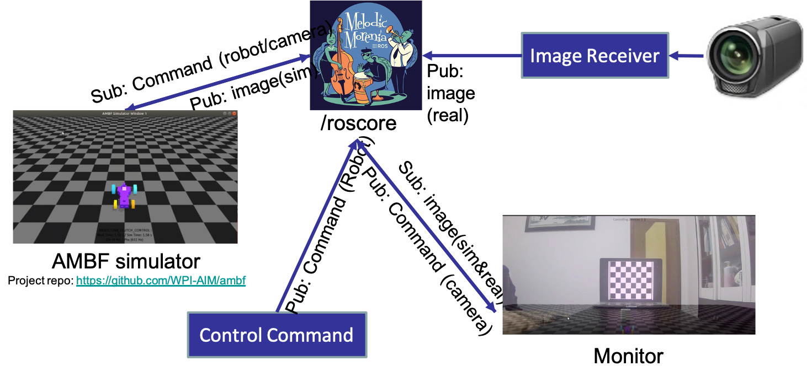
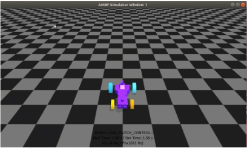
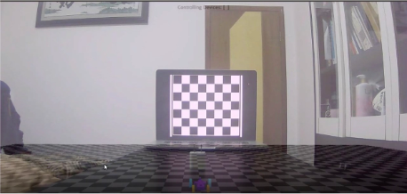

# AR_ghost_monitor
This is the code repo for the course project of Augmented Reality.

## Motivation & Background 
- Automated surgery is a hot topic for Robotic surgery.
- Safety is among the most important factors of evaluation of an automated surgery system.
- Current algorithms especially deep learning-based algorithm is not robust and hard to interpret.
- Need a monitoring and early-stop system to ensure the safety of the automated surgery system.

***Our Goal: Develop an monitoring and early stop system that gives human monitor a future picture of how the automated robot will perform during the procedure of surgery.***

## Coding Environment & Work logic

## Environment set-up & installation
- Unbuntu 18.04 + ROS melodic : please refer to https://ubuntu.com/ and https://www.ros.org/ for installation instructions.
- Ambf simulator: please refer to https://github.com/WPI-AIM/ambf for installation instructions.
- USB Camera set-up: please refoer to https://msadowski.github.io/ros-web-tutorial-pt2-cameras/
- OpenCV-python: please refer to https://pypi.org/project/opencv-python/

## Running an example
### Source ros work spaces for both ambf and ar_ws
    source $path_to_ambf/build/devel/setup.bash
    source $path_to_ar_ws/build/devel/setup.bash
### Setup ROS environment and Camera node
    rosecore
    roslaunch real_camera elp.launch
### run simulator
    cd $path_to_ambf/bin/lin-x86_64 (if other system please choose other directory)
    ./ambf_simulatr -l 2
then a simulation window will show up:

### run video_viewer and calibration
    cd $path_to_ar_ws/src/python_run_file
    python video_viewer.py
Then you will see the video from real camera combined with simulation.
You need to calibrate your camera by putting a marker in front of the camera and press 'c' in the video_viewer.

### run monitor command
    cd $path_to_ar_ws/src/python_run_file
    python monitor_command.py
Then input the pre-defined command file name and watch the video_viewer to see whether those commands are proper to excute.
Input accept if the command is acceptable otherwise, input discard to give up those commands.

### Video Demo
Here is a video demo for running the whole project.

